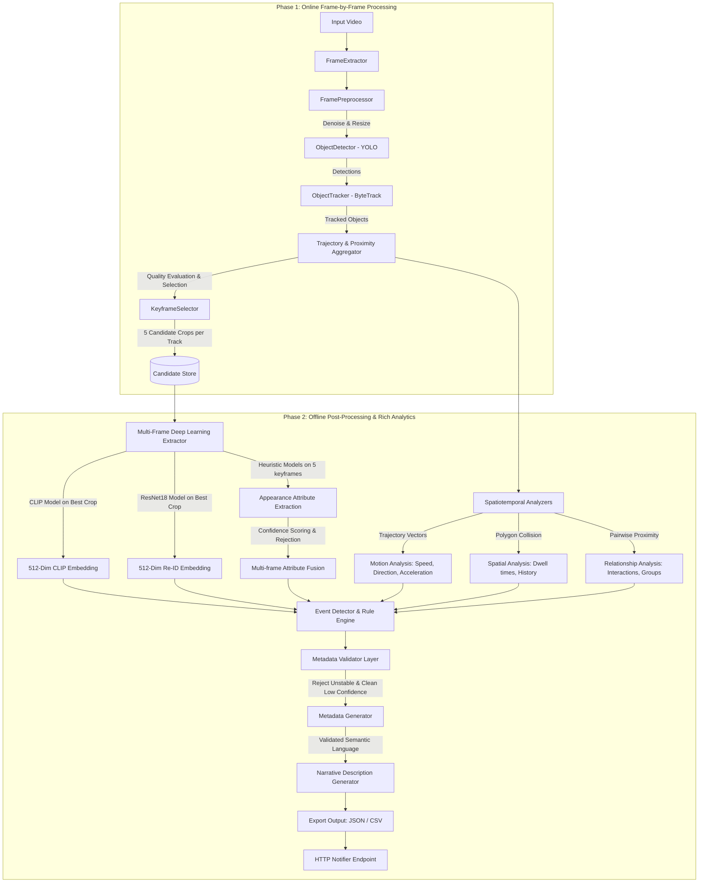

# AI-Vision Pipeline Documentation: Technologies, Tools, & Processing Pipeline

This document provides a detailed overview of the technologies, tools, and the spatiotemporal processing pipeline used in the upgraded **AIVision** video analytics project.

---

## 1. Core Technologies & Tools

The pipeline is built in **Python** and leverages specialized computer vision, deep learning, and data-processing libraries:

| Technology / Tool | Category | Specific Version / Package | Primary Purpose in Pipeline |
| :--- | :--- | :--- | :--- |
| **Python** | Runtime | `>=3.8` | Core execution environment and glue code. |
| **Ultralytics YOLO** | Computer Vision / DL | `ultralytics>=8.3.0` | Loads object detection weights (YOLOv11/v12) to detect classes (`person`, `car`, `motorcycle`, `bus`, `truck`) in each frame. |
| **Roboflow Supervision** | Computer Vision SDK | `supervision>=0.24.0,<0.30.0` | Simplifies bounding box manipulations, class filtering, frame annotations, and supplies the `ByteTrack` interface. |
| **ByteTrack** | Tracking Algorithm | Integrated in `supervision` | Performs multi-object tracking (MOT), associating detections across consecutive frames to form unique trajectories. |
| **OpenCV** | Image Processing | `opencv-python>=4.9.0` | Handles video decoding, resizing, frame denoising, writing annotated output videos, image cropping, and spatial/geometric contours. |
| **PyTorch & Torchvision** | Deep Learning Framework | `torch`, `torchvision` | Powers deep learning inference for Re-ID (ResNet18 backbone) and CLIP embedding generation. |
| **Hugging Face Transformers** | NLP & Multimodal DL | `transformers` (CLIP) | Loads and runs `openai/clip-vit-base-patch32` to produce normalized 512-dim visual embeddings. |
| **Scikit-Learn** | Machine Learning | `scikit-learn>=1.4.0` | Runs spatial color clustering using `KMeans` to classify clothing and vehicle colors. |
| **NumPy** | Mathematics / Arrays | `numpy>=1.26.0` | Performs vectorized operations for centroids, coordinates, trajectories, and edge distributions. |
| **PyYAML** | Configuration | `pyyaml>=6.0` | Parses settings, paths, zones, thresholds, and module configurations from `config.yaml`. |
| **Tqdm** | Utilities | `tqdm>=4.66.0` | Displays command-line progress bars during frame extraction and deep learning inference. |
| **Requests** | Networking | `requests>=2.31.0` | Dispatches finished metadata payloads via HTTP POST requests to downstream systems (AI Search & Backend). |

---

## 2. End-to-End Processing Pipeline

The upgraded pipeline processes video footage in two distinct phases: **Phase 1: Online Frame-by-Frame Processing** (high-speed tracking, coordinate collection, and keyframe selection) and **Phase 2: Offline Post-Processing & Rich Analytics** (DL feature extraction, spatiotemporal analytics, event detection, metadata validation, and semantic description generation).

---

## 3. Detailed Component Breakdown

### A. Video & Frame Ingestion
* **FrameExtractor** (`src/video/frame_extractor.py`): Decodes the video file using OpenCV's `VideoCapture`. To balance processing speed and analytic accuracy, it supports a `frame_skip` factor (e.g., analyzing every 2nd or 3rd frame).
* **FramePreprocessor** (`src/video/preprocessor.py`): Resizes frames to standard analytical resolution (e.g., `960x540`) and runs Fast Bilateral or Gaussian denoising to improve subsequent detection quality.

### B. Object Detection & Tracking
* **ObjectDetector** (`src/detection/detector.py`): Invokes the Ultralytics YOLO model. It filters out irrelevant classes, only returning detections for `person`, `car`, `motorcycle`, `bus`, and `truck`.
* **ObjectTracker** (`src/tracking/tracker.py`): Applies the ByteTrack algorithm to associate box coordinates across consecutive frames. It handles temporary occlusions and maintains a persistent `track_id` for every unique object.
* **TrajectoryTracker** (`src/tracking/trajectory.py`): Aggregates the coordinate history (centroids, bounding boxes, timestamps, frame indices) for every active track.

### C. Multi-Keyframe Selection & Quality Assessment
* **KeyframeSelector** (`src/video/keyframe_selector.py`): Evaluates all incoming crops during online processing. It assesses the image quality (sharpness, blur, brightness) and selects five distinct keyframe crops for each track at the end of execution:
  1. **First frame**: First seen crop.
  2. **Middle frame**: Chronologically centered crop.
  3. **Largest bounding box**: Bounding box with the largest area (highest resolution details).
  4. **Last frame**: Last seen crop.
  5. **Highest quality**: Crop with the highest sharpness index.
* **Quality Assessment**: 
  - **Brightness**: Grayscale pixel mean value.
  - **Sharpness/Blur**: Laplacian variance of the crop.
  - Crops falling outside of configurable limits (defined under `quality` in `config.yaml`) are rejected.

### D. Appearance Attributes & Fusion
* **Color Recognition** (`src/attributes/color_utils.py`): Fits a `KMeans` cluster on selected crops to categorize colors. It now includes:
  - **CLAHE Lighting Normalization**: Normalizes shadows/specular reflections by equalizing the V channel of the HSV crop.
  - **Background Masking**: Crops to the inner center patch (middle 70% width, 80% height) to avoid boundary background.
  - **Shadow/Specular Masking**: Masks out pixels with very low Value ($V < 15$) or high Value ($V > 250$).
  - **Skin-tone Exclusion Masking**: Excludes skin-tone pixels from clustering using a YCrCb filter (configurable thresholds in `config.yaml`: `Cr` in `[133, 173]`, `Cb` in `[77, 127]`) to prevent skin, arms, or face pixels from polluting the clothing color.
  - **Contiguous Spatial Winner Selection**: Instead of picking the cluster with the absolute highest pixel count, the labels are mapped to a 2D map, and `cv2.connectedComponentsWithStats` is used on the per-cluster masks. The winning cluster is the one whose single largest contiguous spatial component has the maximum area. This successfully rejects scattered background noise or logo textures.
  - **Confidence Scores**: Returns a confidence based on cluster pixel density and proximity to standard color templates using a CIEDE2000 distance mapping scale (sigma threshold configurable in `config.yaml`).
* **Confidence-Based Extraction** (`src/attributes/deep_attribute_extractor.py`): Computes soft sigmoid probabilities for person/vehicle attributes (cap, helmet, bag, clothing type, vehicle color, body type, and roof racks).
* **Multi-Frame Attribute Fusion** (`src/metadata/metadata_generator.py`): Takes the appearance predictions from all 5 keyframes and applies confidence-weighted majority voting to determine a stable, final value and confidence score. Instead of static weights, it computes a dynamic weight per keyframe: `weight = base_type_weight * (sharpness_score / max_sharpness_in_track) * color_confidence_score` (using keyframe sharpness metrics and the CIEDE2000 color confidence). This eliminates frame-to-frame attribute flickering and prevents blurry, low-contrast, or out-of-focus keyframes from corrupting the fused attributes.
* **Crop Paths Preservation**: The final JSON database preserves all keyframe crops (`best`, `first`, `middle`, `largest_bbox`, `last`, `highest_quality`) alongside online sample crops by writing the entire compiled crop list instead of truncating.

### E. Advanced Spatiotemporal Analytics
* **MotionAnalyzer** (`src/motion/motion_analyzer.py`): Processes track trajectories to compute:
  - **Acceleration**: Frame-to-frame velocity derivatives.
  - **Stationary Duration**: Maximum continuous duration spent stationary.
  - **Movement Confidence**: Sigmoid score representing displacement compared to tracker noise.
  - **Smoothed Direction**: Rolling window average heading estimation.
* **ZoneAnalyzer** (`src/spatial/zone_analyzer.py`): Traces polygon crossings to report `previous_zone`, `current_zone`, `entry_timestamp`, `exit_timestamp`, `total_dwell_time` in actual zones, and a complete chronological `zone_history` list.
* **RelationshipAnalyzer** (`src/relationships/relation_analyzer.py`): Performs proximity graph traversals to calculate:
  - **Interaction Duration**: Cumulative time spent close to *any* other track.
  - **Nearest Object / Nearest Vehicle**: The closest track ID and closest vehicle ID on average.
  - **Group Confidence**: Proximity overlap ratio of group members.
* **EventDetector** (`src/events/event_rules.py`): Configurable rule engine checking for events: `entered`, `exited`, `stopped`, `loitering`, `running`, `crowd`, `long_stop`, `suspicious_loitering` (person loitering in Gate/Parking), and `prolonged_vehicle_parking` (vehicle parked in Gate/Parking).

### F. Validation Layer & Export
* **MetadataValidator** (`src/metadata/metadata_validator.py`): Before export, validates track stability (`min_observations`, `min_track_duration_sec`), bounding box dimensions, and keyframe quality. Drops unstable tracks entirely and overwrites low-confidence attributes with `"unknown"`.
* **Description Generator** (`src/metadata/metadata_generator.py`): Generates descriptions only after metadata validation, using strictly validated attributes and falling back to base categories to prevent hallucination.
* **Exporter (`MetadataGenerator.save_csv` & `save_json`)**: Exports finalized records into JSON (`metadata.json`) and CSV (`metadata.csv`). The CSV output includes explicit columns: `track_id`, `camera_id`, `class`, `vehicle_type`, `vehicle_number` (partial plate read), `color`, `upper_body`, `lower_body`, `first_seen`, `last_seen`, `duration`, `zone`, `events`, `group_size`, `near_vehicle`, and `description`.
* **Color Extraction Optimization (`src/attributes/color_utils.py`)**: Preserves white paint colors by checking original crop saturation (`S < 35`) and brightness (`V > 175`) before CLAHE equalization and preserving high-brightness pixels in the specular mask, preventing bright white vehicles from being misclassified as gray.
* **Notifier**: Sends the finalized JSON output to integration endpoints via HTTP POST.
